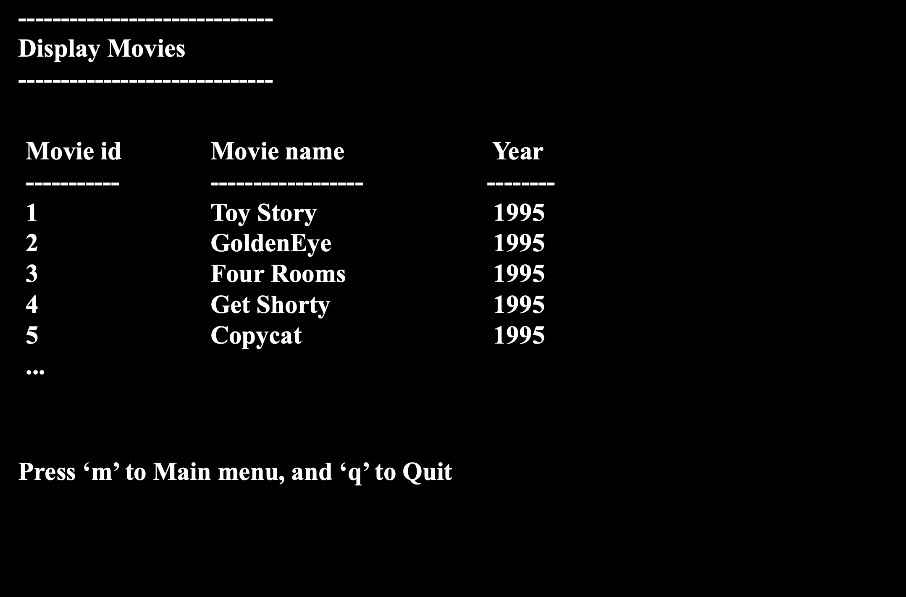
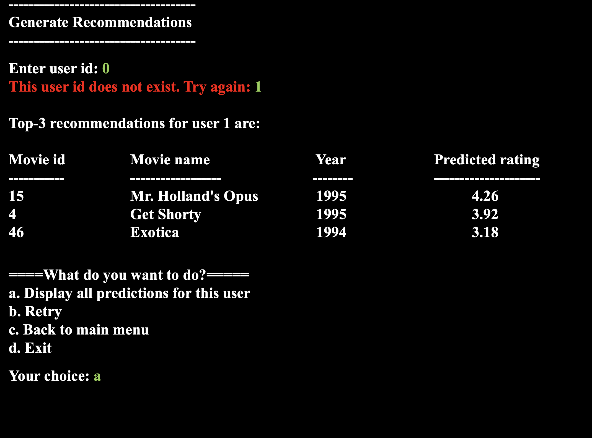

# Mini IMDB Management System

## Overview
This project implements a **Mini IMDB Management System** in **C++**. It allows users to manage a movie database, rate movies, calculate user similarities, and generate personalized movie recommendations.

## Features
- **Display Movies**: View all movies available in the database.
- **Display Ratings**: View ratings provided by a specific user.
- **Calculate Similarity**: Compute similarity between two users based on their ratings.
- **Generate Recommendations**: Generate top movie recommendations for a user.
- **Rate Movies**: Users can rate movies.
- **Add/Remove Movies**: Add new movies or remove existing ones.

## Files Included
- `IMDB.cpp`: Main C++ program with functionalities.
- `Movies.txt`: Contains movie details (ID, Name, Year, IMDB URL, Genre).
- `Ratings.txt`: User ratings for movies (User ID, Movie ID, Rating).
- `Manual.pdf`: User manual and instructions.

## Installation
1. Clone the repository:
   ```bash
   git clone https://github.com/your-username/Mini-IMDB.git
   cd Mini-IMDB
   ```

2. Compile the C++ program:
   ```bash
   g++ IMDB.cpp -o IMDB
   ```

3. Run the executable:
   ```bash
   ./IMDB
   ```

## How to Use
- **Main Menu:**
  - Choose an option by entering the corresponding number.

- **Display Movies:**
  - Lists all movies in the database along with their release years.

- **Display Ratings:**
  - Enter a user ID to view ratings given by that user.

- **Calculate Similarity:**
  - Enter two user IDs to calculate their similarity based on common movie ratings.

- **Generate Recommendations:**
  - Enter a user ID to receive the top-3 movie recommendations based on user similarities.

- **Rate Movies:**
  - Enter User ID, Movie ID, and Rating (1-5) to rate a movie.

- **Add/Remove Movies:**
  - Add a new movie by entering the name and year.
  - Remove a movie by its name or ID.

## Example Usage
- **Generate Recommendations:**
  ```
  Enter user id: 1
  Top-3 recommendations for user 1 are:
  Movie id	Movie name	Year	Predicted rating
  --------	----------	----	----------------
  10	Richard III	1995	4.5
  25	The Birdcage	1996	4.3
  50	Star Wars	1977	4.2
  ```

## Screenshots



